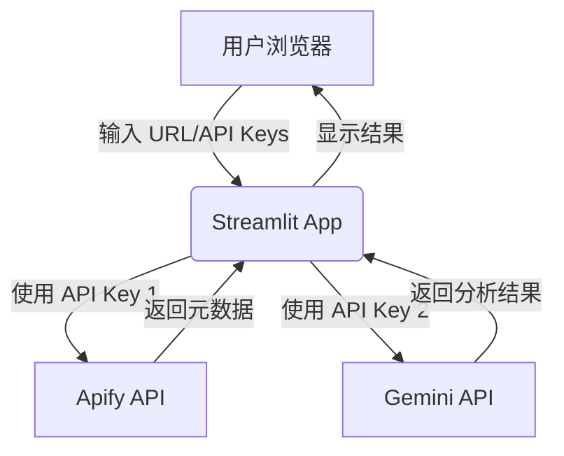
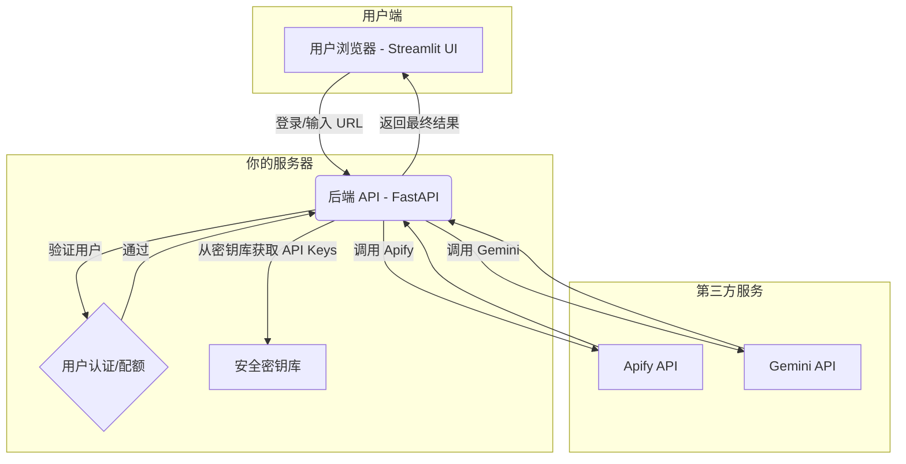

# 生产环境 API 安全架构指南

**版本**: 1.0
**作者**: Manus AI
**日期**: 2026-02-04

## 1. 核心问题：为什么不能在前端直接使用 API Keys？

将 API Keys 直接暴露在前端代码中（即使是 Streamlit 应用）是极其危险的。当前架构虽然便于快速原型开发，但在生产环境中存在严重的安全隐患。

### 1.1. 主要风险

| 风险类别 | 描述 |
| :--- | :--- |
| **财务损失** | 任何人都可以从前端代码中提取你的 Apify 和 Gemini API Keys，并用你的账户进行大规模调用，导致高昂的账单费用。 |
| **服务滥用** | 恶意用户可能使用你的 API Keys 进行非法活动，如爬取敏感数据、生成不当内容等。 |
| **服务封禁** | 由于滥用行为，你的 Apify 或 Google Cloud 账户可能会被暂停或永久封禁，导致你的服务中断。 |
| **数据泄露** | 如果 API Keys 具有超出预期的权限，攻击者可能访问到你的其他云服务或数据。 |

> **关键原则**: 任何部署在客户端（浏览器）的代码都是不安全的。攻击者可以通过浏览器开发者工具轻松查看网络请求、提取 JavaScript 代码中的密钥，或反编译 WebAssembly [1]。

## 2. 推荐架构：前后端分离

为了从根本上解决安全问题，我们必须将架构从**“富客户端”**模式转变为**“前后端分离”**模式。

### 2.1. 当前架构（开发模式）



- **问题**: API Keys 存在于 Streamlit 的环境中，并可能通过网络传输暴露给客户端。

### 2.2. 推荐架构（生产模式）



### 2.3. 架构组件说明

1.  **前端 (Streamlit App)**
    -   **角色**: 纯粹的 UI 层，只负责展示界面和与用户交互。
    -   **变化**: **不再包含任何 API Keys**。所有数据请求都发送到我们自己创建的后端 API。

2.  **后端 API (使用 FastAPI)**
    -   **角色**: 业务逻辑和安全的核心。
    -   **功能**:
        -   **API 封装**: 创建自己的 API 端点，如 `/api/analyze`。
        -   **密钥管理**: 安全地存储和使用 Apify 和 Gemini API Keys。密钥应通过环境变量或专用的密钥管理服务（如 AWS Secrets Manager）注入 [2]。
        -   **用户认证**: 验证发出请求的用户身份。
        -   **配额与速率限制**: 防止单个用户滥用服务。

3.  **用户认证/配额模块**
    -   **角色**: 管理用户身份和使用量。
    -   **实现**: 可以从简单的 API Token 认证开始，逐步扩展到完整的用户数据库和 OAuth2 认证。

## 3. 实施步骤

### 步骤 1: 创建后端 API (FastAPI)

我们将使用 FastAPI，因为它性能高、易于学习，并且与 Streamlit 社区结合紧密。

**示例代码 (`backend/main.py`)**:

```python
from fastapi import FastAPI, Depends, HTTPException
from pydantic import BaseModel
import os

# 导入你的核心逻辑
from src.tiktok_fetcher import TikTokFetcher
from src.video_analyzer import VideoAnalyzer

app = FastAPI()

# --- 安全：从环境变量加载 API Keys ---
apify_token = os.getenv("APIFY_API_TOKEN")
gemini_key = os.getenv("GEMINI_API_KEY")

# --- 简单的 API Token 认证 ---
API_USERS = {
    "user1_token": {"username": "user1", "quota": 100},
    "user2_token": {"username": "user2", "quota": 500}
}

def get_current_user(token: str):
    if token not in API_USERS:
        raise HTTPException(status_code=401, detail="Invalid API Token")
    return API_USERS[token]

class AnalyzeRequest(BaseModel):
    video_url: str

@app.post("/api/analyze")
def analyze_video(request: AnalyzeRequest, user: dict = Depends(get_current_user)):
    # 可以在这里添加配额检查逻辑
    
    # 1. 获取元数据
    fetcher = TikTokFetcher(api_token=apify_token)
    video_data = fetcher.fetch_video_data(request.video_url)
    
    # 2. 下载和分析视频
    analyzer = VideoAnalyzer(api_key=gemini_key)
    # ... (执行分析逻辑)
    
    return {"metadata": video_data, "analysis": analysis_result}
```

### 步骤 2: 修改 Streamlit 前端

前端不再需要 API Key 输入框，而是需要一个输入框来填写分配给用户的 **个人访问令牌 (Personal Access Token)**。

**示例代码 (`app.py`)**:

```python
import streamlit as st
import requests

st.title("E-Com Video Insider")

# 用户输入自己的访问令牌
user_token = st.text_input("Your Access Token", type="password")
video_url = st.text_input("TikTok/Shorts URL here")

if st.button("🚀 Analyze Now"):
    if not user_token or not video_url:
        st.error("Please provide your Access Token and a video URL.")
    else:
        backend_url = "http://localhost:8000/api/analyze" # 后端 API 地址
        headers = {"Authorization": f"Bearer {user_token}"}
        payload = {"video_url": video_url}
        
        with st.spinner("Analyzing..."):
            response = requests.post(backend_url, json=payload, headers=headers)
            
            if response.status_code == 200:
                st.success("Analysis complete!")
                st.json(response.json())
            else:
                st.error(f"Error: {response.text}")
```

### 步骤 3: 部署

使用 Docker Compose 可以轻松地同时部署前端和后端。

**示例 (`docker-compose.yml`)**:

```yaml
version: '3.8'
services:
  backend:
    build: ./backend
    ports:
      - "8000:8000"
    environment:
      - APIFY_API_TOKEN=${APIFY_API_TOKEN}
      - GEMINI_API_KEY=${GEMINI_API_KEY}

  frontend:
    build: .
    ports:
      - "8501:8501"
    # 前端不再需要 API Keys
```

## 4. 用户认证与配额管理

### 4.1. 用户认证方案

| 方案 | 优点 | 缺点 | 适用场景 |
| :--- | :--- | :--- | :--- |
| **静态 API Token** | 实现简单，快速 | 不易管理，撤销困难 | 内部使用，少数用户 |
| **数据库用户系统** | 灵活，可扩展，支持注册/登录 | 开发工作量大 | 面向公众的 SaaS 产品 |
| **OAuth (Auth0, Okta)** | 安全，功能强大，省去开发 | 依赖第三方服务，有成本 | 企业级应用，需要单点登录 |

**建议**: 从 **静态 API Token** 开始，验证产品市场匹配度后，再投入开发完整的用户系统。

### 4.2. 配额与速率限制

为了防止服务被滥用，必须对每个用户进行限制。

-   **速率限制 (Rate Limiting)**: 限制单位时间内的请求次数（如每分钟 10 次）。
-   **配额 (Quota)**: 限制总使用量（如每月 1000 次分析）。

可以使用 `slowapi` 等库在 FastAPI 中轻松实现速率限制 [3]。

## 5. 总结与建议

将应用上线需要从“原型思维”切换到“产品思维”，安全是其中最重要的一环。

**行动路线图**:

1.  **立即分离后端**: 创建一个独立的 FastAPI 应用来封装所有第三方 API 调用。
2.  **实现简单的 Token 认证**: 为你的第一批用户手动生成访问令牌。
3.  **重构前端**: 移除所有 API Key 逻辑，改为调用你自己的后端 API。
4.  **部署**: 使用 Docker Compose 将前后端一起部署。
5.  **迭代**: 根据用户反馈，逐步引入更完善的用户系统和配额管理。

这个架构不仅能保护你的 API Keys，还能为你未来的功能扩展（如用户管理、计费、数据分析）打下坚实的基础。

---

### 参考文献

[1] MDN Web Docs, "Content security policy (CSP)," *Mozilla Developer Network*, 2023. [Online]. Available: https://developer.mozilla.org/en-US/docs/Web/HTTP/CSP

[2] AWS, "AWS Secrets Manager," *Amazon Web Services, Inc.*, 2023. [Online]. Available: https://aws.amazon.com/secrets-manager/

[3] slowapi documentation, "FastAPI + slowapi," *slowapi.readthedocs.io*. [Online]. Available: https://slowapi.readthedocs.io/en/latest/integrations.html#fastapi
